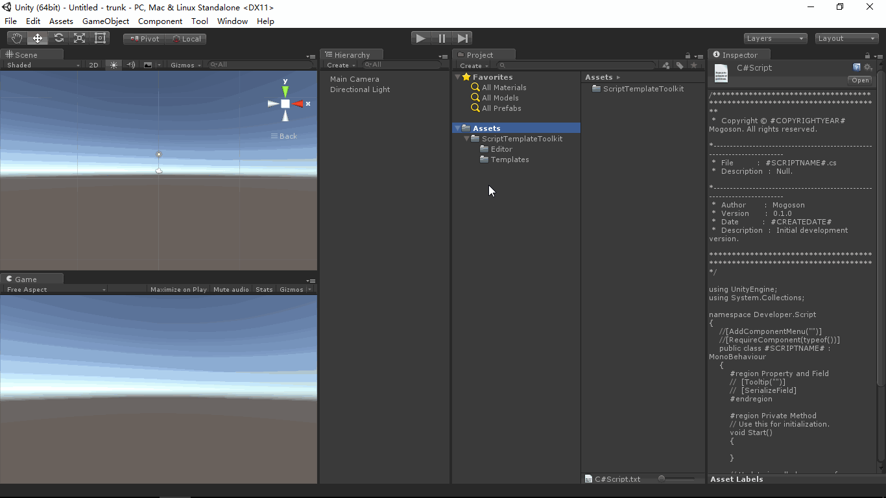

# ScriptTemplateToolkit
- [English Manual](./README.md)

## 概述
- Unity脚本模板工具包。

## 需求
- 在使用Unity创建脚本文件时，希望Unity编辑器自动按照个人喜好预定义的模板来创建各类脚本文件，例如添加文件头注释等。
- 希望在脚本头注释中自动标注脚本创建日期以及标注版权开始年份。

## 环境
- Unity 5.0 或更高版本。
- .Net Framework 3.0 或更高版本。

## 条件
- 实际上，Unity将各类脚本文件模板放在了安装目录下（例如：Unity 5.0.0f4\Editor\Data\Resources\ScriptTemplates）。
- 在Unity提供的API中，可以通过AssetModificationProcessor类的OnWillCreateAsset方法捕获Unity编辑器创建Asset（包括脚本文件）事件。

## 方案
### 编辑
- 编写Unity扩展编辑器代码，通过继承EditorWindow绘制自定义编辑器窗口来编辑/保存Unity的各类脚本文件模板（文本文件）。
- 预定义标注字符串，“#CREATEDATE#”标注创建日期，“#COPYRIGHTYEAR#”标注版权开始年份声明，在编辑模板时，在需要插入创建日期的地方使用
“#CREATETIME#”标注，在需要插入版权开始年份的地方使用“#COPYRIGHTYEAR#”标注。
- 使用预定义标注字符串编辑个人喜好风格的脚本文件模板。

### 创建
- 在Unity编辑器的Project面板通过鼠标右键菜单创建脚本文件（例如：C#）时，Unity引擎会将相应的模板文件里边的内容拷贝到新建的文件中，且自动将“#SCRIPTNAME#”替换为新建文件时输入的文件名。但是，“#CREATEDATE#”，“#COPYRIGHTYEAR#”是我们自定义的标注字符串，Unity引擎不会识别，也不会将其替换成我们预期的内容。
- 编写扩展编辑器代码，继承AssetModificationProcessor类并实现其OnWillCreateAsset(string assetPath)
方法以捕获Unity编辑器创建Asset（包括脚本文件）事件以及处理我们自定义的标注字符串。
- 捕获到创建Asset事件，检查文件扩展名，如果是.cs或.js或.shader或.compute则说明创建的是脚本文件，也就是说Unity引擎会按照相应的模板（例如C#脚本模板，我们之前已经将其编辑成个人喜好风格的文本）来创建。（扩展编辑器代码）读取新建文件的内容，将“#CREATEDATE#”替换成当前日期，将“#COPYRIGHTYEAR#”替换成当前年份。

## 实现
### 扩展编辑器
- ScriptTemplateEditor：读取/编辑/保存Unity各类脚本模板文件。
- ScriptTemplateModifier：捕获创建事件，替换预定义标注字符串为其具体含义的内容。

### 脚本模板示例
- “ScriptTemplateToolkit/Templates” 目录存放各类脚本模板文件的示例，以供读者编写自己风格的模板时参考。
- 脚本模板示例中的版权申明参考的是[美国版权局](https://www.copyright.gov/)公示的规范。

## 预览
- ScriptTemplateEditor

## 联系
- 如果你有任何问题或者建议，欢迎通过mogoson@outlook.com联系我。